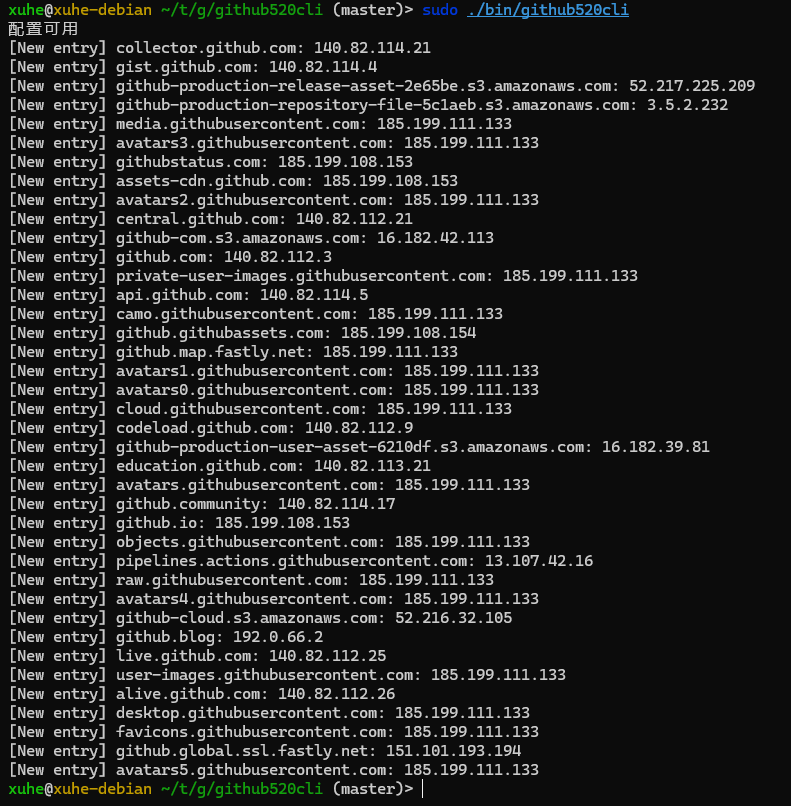

# 是什么

github520cli是一个使用GO编写,依赖[github520](https://github.com/521xueweihan/GitHub520)的命令行工具,用于修改hosts文件,解决github访问慢的问题。
- 支持MAC, Linux和Windows系统

# 为什么

手动修改hosts文件太麻烦了,而且存在出错的可能,所以写了这个工具。

# 怎么用

## Linux和mac系统

```shell
sudo ./github520cli
```
> 注意: 在mac和linux系统上需要使用sudo命令,否则会报权限错误.



## Windows系统

- 在Windows系统上需要使用管理员权限运行

